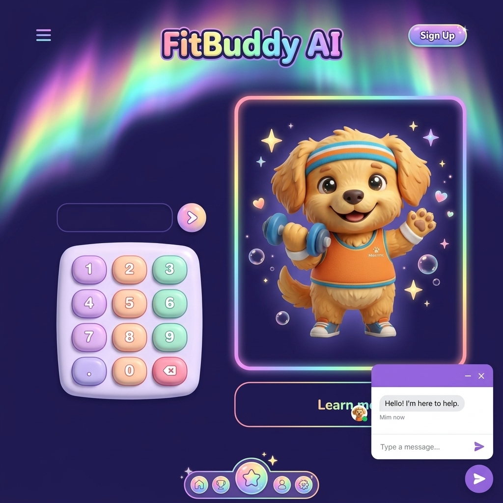
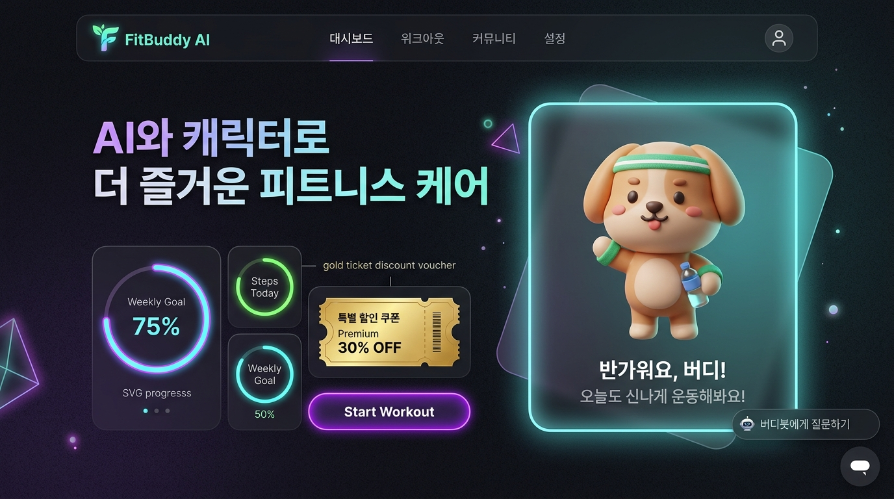
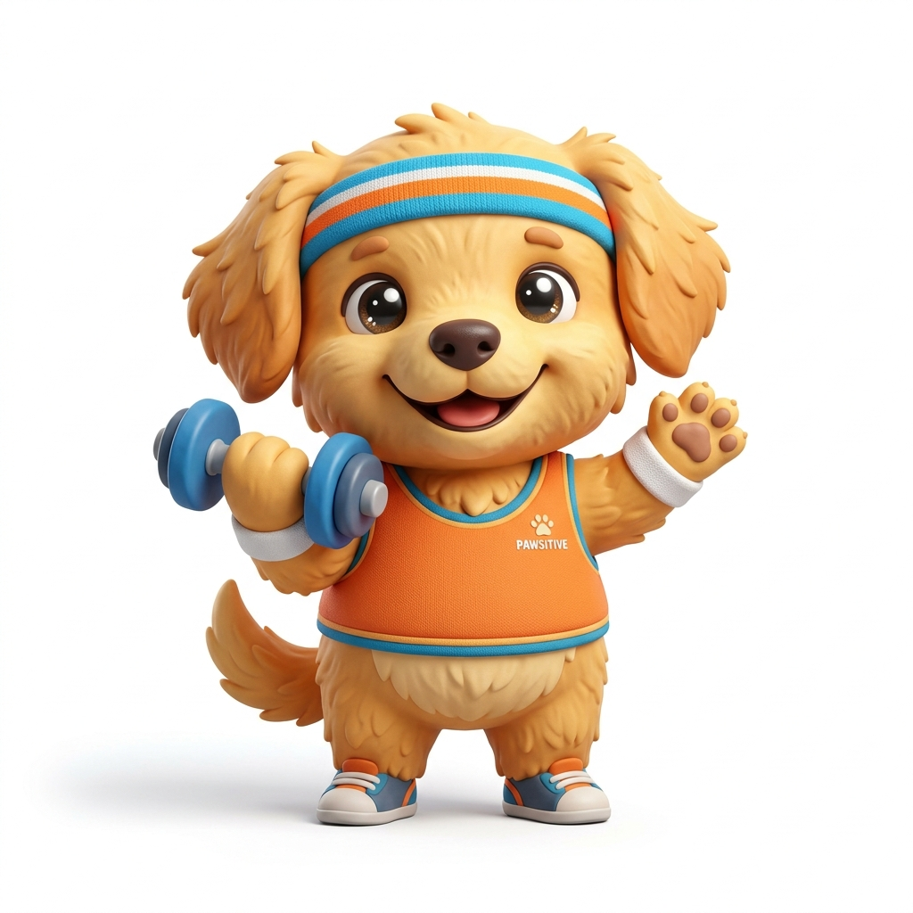
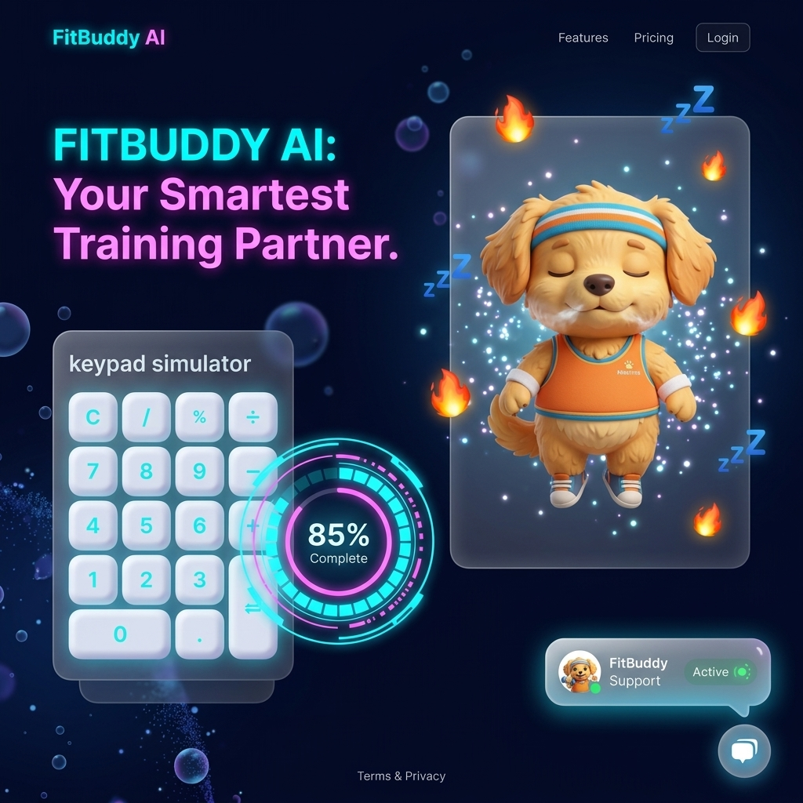
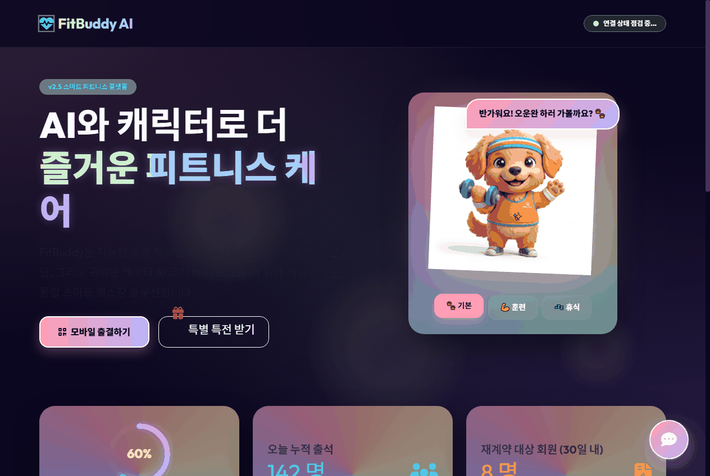

# 🐾 FitBuddy AI - 스마트 피트니스 케어 플랫폼

> **귀여운 캐릭터 마스코트와 AI 기술이 접목된 차세대 지능형 체육관/피트니스 센터 관리 플랫폼입니다.**

---

## 🖥️ 홈페이지 프리뷰 (Preview)

| 메인 레인보우 드림 테마 | 다크 글래스모피즘 랜딩 |
| :---: | :---: |
|  |  |

| 메인 마스코트 버디 (Buddy) | 대시보드 및 상세 UI |
| :---: | :---: |
|  |  |

---

## 📹 실제 동작 데모 (Demo Video)



---

## 🌟 주요 화면 및 제공 기능

### 1. 스마트 출결 시뮬레이터 (Check-In & Out)
- **회원 출결 시스템**: 회원 ID(전화번호 숫자)를 입력하여 가상으로 출석(체크인) 및 퇴장(체크아웃)을 처리할 수 있습니다.
- **실시간 혼잡도 대시보드**: 출결에 따라 현재 이용 인원 수 및 헬스장 혼잡도가 차트와 애니메이션 효과를 통해 실시간으로 자동 증가 및 감소합니다.

### 2. AI 코치 버디(Buddy) 라이브 채팅 위젯
- **지능형 운동 가이드**: 우측 하단의 플로팅 상담 버블을 클릭하면 3D 마스코트 버디가 인사하며 실시간 운동 추천, 식단 관리 팁, 멤버십 할인 쿠폰 정보를 안내해 줍니다.
- **하이브리드 예외 처리**: 백엔드 DB 서버가 오프라인일 경우에도 프론트엔드 자체 시뮬레이션 모드로 매끄럽게 작동하도록 구성되어 있습니다.

### 3. 스페셜 멤버십 쿠폰 선물 상자 (Confetti 애니메이션)
- **쿠폰 이벤트**: 메인 화면의 다이어그램 상자를 마우스로 클릭하면 상자가 요동치며 열리고, 화면 가득 축하 색종이(Confetti)들이 휘날리며 특별 쿠폰 코드가 발급되는 애니메이션 모션이 제공됩니다.

### 4. 체육관 소통창 (Gym Boss) 건의함
- **불편 및 건의사항 접수**: 시설 불편 사항 등을 입력하면 사장님 및 트레이너에게 건의 내역이 전송되는 폼(Form)이 예쁜 인터랙션 디자인과 함께 탑재되어 있습니다.

---

## 🛠️ 기술 스택 (Tech Stack)

- **Frontend**: HTML5, Vanilla CSS, JS (ES6+), Bootstrap 5, Animate.css, Canvas Confetti
- **Backend**: Spring Boot, Java 21, JPA/Hibernate, MyBatis, Spring Security
- **Database**: PostgreSQL (Supabase Cloud hosting)
- **AI Integration**: Anthropic Messages API (Claude model Integration)

---

## 🚀 시작 가이드 (Quick Start)

### 1. 서버 구동
로컬 터미널(PowerShell) 환경에서 다음 명령어를 실행하여 서버를 시작합니다.

```powershell
$env:JAVA_HOME="C:\Program Files\Java\jdk-21.0.10"; .\gradlew bootRun
```

### 2. 브라우저 접속
서버 구동 완료 후 웹 브라우저를 통해 아래 주소로 접속해 주세요.
- **URL**: [http://localhost:8181/](http://localhost:8181/)
